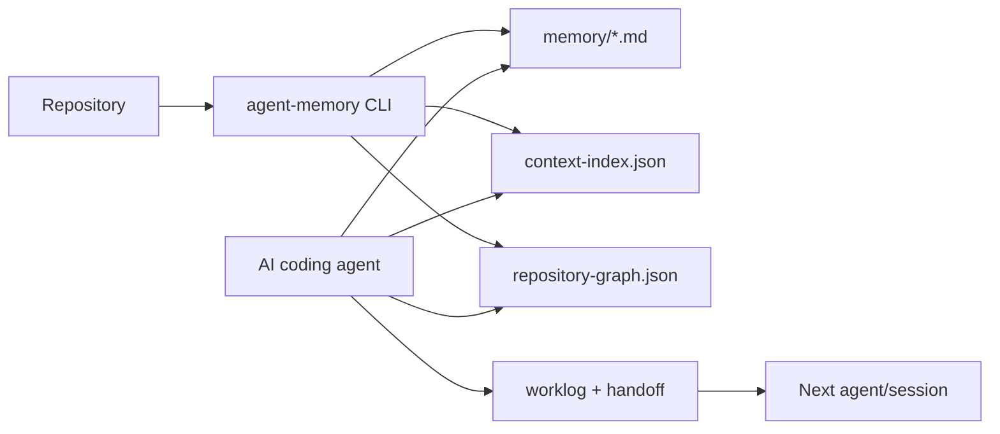

<p align="center">
  
</p>

<h1 align="center">Agent Memory System</h1>

<p align="center">
  Persistent repository memory, worklogs, handoffs, and code graph context for AI coding agents.
</p>

<p align="center">
  <a href="https://www.npmjs.com/package/@ravbyte/agent-memory-system"></a>
  <a href="https://www.npmjs.com/package/@ravbyte/agent-memory-system"></a>
  <a href="https://github.com/RavByte-AI/agent-memory-system/actions/workflows/ci.yml"></a>
  <a href="https://github.com/RavByte-AI/agent-memory-system"></a>
  <a href="https://github.com/RavByte-AI/agent-memory-system/blob/main/LICENSE"></a>
</p>

Agent Memory System is a TypeScript CLI that creates a repository-local memory layer for AI coding agents. It generates reviewable Markdown and JSON artifacts that describe project structure, development workflow, API/storage/security context, static code graph, agent worklogs, and handoffs.

The goal is to help coding agents resume work across sessions and tools without rediscovering the codebase from scratch.

AMS is not a chatbot memory service, vector database, or agent runtime. It is a repo-local context layer for tools such as Codex, Claude Code, Cursor, Gemini CLI, Antigravity, and other coding agents that can read files before acting.

## Current Benchmark Snapshot

Maintainer-run self-benchmark on 21 repository tasks. These results are checked into the repo and should be treated as early measurements, not independent validation.

| Metric | Baseline | AMS | Observed change |
| --- | ---: | ---: | ---: |
| Average files traversed | 35 | 19 | 45% fewer files |
| Concept accuracy | 66% | 100% | +34 percentage points |
| Average hallucinated files | 1.0 | 1.0 | 0% change |
| Average tokens per task | 34,487 | 42,467 | AMS used more tokens in this run |

[Read the benchmark summary](./benchmarks/reports/current-results.md) or inspect the raw run data in `benchmarks/runs/` and `benchmarks/metrics/`.

## Why This Exists

AI coding agents often start cold. Even when a previous agent already explored the codebase, the next session may repeat the same file traversal, miss prior decisions, or change shared interfaces without checking downstream usage.

AMS makes that context explicit:

- project structure and likely entry points
- build, test, and quality commands
- API, storage, security, and config notes
- static dependency graph and blast-radius reports
- checkpoints during long work
- handoff notes before switching agents or sessions

## Quick Start

Run once in a repository:

```bash
npx @ravbyte/agent-memory-system@latest init
```

This creates a `memory/` directory and an `AGENTS.md` instruction file.

Refresh memory after structural changes:

```bash
npx @ravbyte/agent-memory-system@latest maintain --since main
```

If installed globally:

```bash
npm install -g @ravbyte/agent-memory-system@latest
agent-memory init
agent-memory maintain --since main
```

## How It Fits Together



## What Gets Generated

| Artifact | Purpose |
| --- | --- |
| `AGENTS.md` | Agent instructions for reading and maintaining the memory layer. |
| `memory/context-index.json` | Machine-readable index of memory topics and files. |
| `memory/00-project-overview.md` | Project shape, languages, frameworks, quick-start commands, and ownership context. |
| `memory/01-repository-map.md` | Source, config, docs, generated, and vendor boundaries. |
| `memory/04-api-and-interfaces.md` | Likely API, route, and interface files. |
| `memory/07-testing-and-quality.md` | Test/build commands and quality gates. |
| `memory/repository-graph.json` | Static dependency and symbol graph, when graph build is enabled. |
| `memory/architecture-flow.md` | Human-readable graph summary. |
| `memory/agent-worklog.jsonl` | Append-only agent checkpoints. |
| `memory/agent-handoff.md` | Current handoff state for the next agent/session. |

## Example Agent Workflow

Before editing a shared type or interface:

1. Read `AGENTS.md`.
2. Open `memory/context-index.json`.
3. Open the relevant memory file, such as `memory/04-api-and-interfaces.md`.
4. Query the graph:

```bash
agent-memory graph query --file src/types.ts
```

5. Make the change.
6. Run the repository's test command from `memory/07-testing-and-quality.md`.
7. Record a checkpoint:

```bash
agent-memory worklog checkpoint \
  --agent codex \
  --message "updated shared interface and verified downstream tests" \
  --files src/types.ts,tests/types.test.ts \
  --commands "npm test"
```

Before switching agents or stopping mid-task:

```bash
agent-memory worklog handoff \
  --agent codex \
  --message "tests pass; README still needs review" \
  --next "review docs and publish release notes"
```

## Code Graph And Blast Radius

AMS includes a headless static analysis engine that tracks symbol-level dependencies, architectural layers, and call relationships.

Build graph artifacts:

```bash
agent-memory graph build
```

Query the impact of a shared file:

```bash
agent-memory graph query --file src/types.ts
```

Check API surface changes between graph snapshots:

```bash
agent-memory graph diff
```

The graph is intended to give agents a better starting map before they edit high-impact files. It is static analysis, so results should still be checked against tests and code review.

## Benchmarks And Reproducibility

AMS includes an early benchmark harness for testing whether repository memory changes coding-agent workflows.

The benchmark compares:

- baseline: an agent starts from repository files only
- AMS: an agent starts with generated memory, graph artifacts, worklog, and handoff files

Task categories include repository understanding, refactoring, debugging, recovery, and multi-agent continuity. Current results should be treated as maintainer-run measurements, not independent validation.

See:

- [Benchmark suite](./benchmarks)
- [Current maintainer-run results](./benchmarks/reports/current-results.md)
- [Benchmark specification](./benchmarks/spec/benchmark-spec.md)
- [Scoring rubric](./benchmarks/spec/scoring-rubric.md)
- [Limitations](./benchmarks/spec/limitations.md)

This suggests AMS can reduce broad file traversal and improve project-concept recall when generated memory contains the relevant facts. It also shows why benchmark transparency matters: memory context has an upfront token cost, so future runs should measure when that cost pays off.

Run the current harness:

```bash
npx tsx benchmarks/scripts/run.ts --repo . --mode both
npx tsx benchmarks/scripts/report.ts
```

Future benchmark reports should include commit SHA, AMS version, repository fixture, agent/model version, exact prompt, raw or redacted logs, scoring rubric version, and known limitations.

## Demo Plan

Planned demo assets are documented in [docs/demo-assets.md](./docs/demo-assets.md). The first demo should be a short terminal recording showing:

1. `init`
2. generated `memory/` files
3. a graph query
4. a worklog checkpoint
5. a handoff file

## Security Model

- Documents environment variable names, never values.
- Validates generated memory for obvious secret patterns.
- Ignores generated and vendor paths such as `node_modules/`, `.git/`, `dist/`, `build/`, `.next/`, `.venv/`, `__pycache__/`, and `target/`.
- Labels uncertain sections as `[INFERRED]`, `[INCOMPLETE]`, or `[PLANNED]`.
- Supports CI checks so stale memory cannot silently pass review.
- Encourages branch protection so all changes go through pull requests and CI.

## Integrations And Agent Instructions

AMS works best when the repository's agent instructions tell coding tools how to use generated memory.

Useful patterns:

- Codex: read `AGENTS.md`, open the relevant memory file, and run graph queries before shared-interface edits.
- Claude Code: use generated project memory and handoff files as repo-level context.
- Cursor/Gemini CLI/Antigravity: include generated `memory/` files as project context and update them after structural changes.

## Contributing

Public contributions are welcome. Good first areas:

- add framework and route detectors
- improve generated memory templates
- add graph parser coverage
- improve benchmark fixtures
- add integration docs for coding agents
- improve examples and docs

Before opening a pull request:

```bash
npm install
npm run typecheck
npm test
npm run build
npm run memory:check
```

PRs that change generated memory shape should include before/after examples. Changes to `main` should go through pull requests with the `Required CI` status check passing.

## Project Status

AMS is early. The core CLI is usable, but benchmark methodology, graph coverage, and agent-specific integrations are still evolving. The project favors reviewable artifacts and deterministic scanning over hidden model calls.

## Ownership

- Founder: Gaurav Singh
- Company: RAVBYTE TECHNOLOGIES PRIVATE LIMITED
- Website: https://www.ravbyte.com
- Repository: https://github.com/RavByte-AI/agent-memory-system

## Sponsor

Support ongoing open-source development:

- GitHub Sponsors: https://github.com/sponsors/gaurav-1302
- PayPal: https://paypal.me/gauravchaudhary1302

## License

MIT
