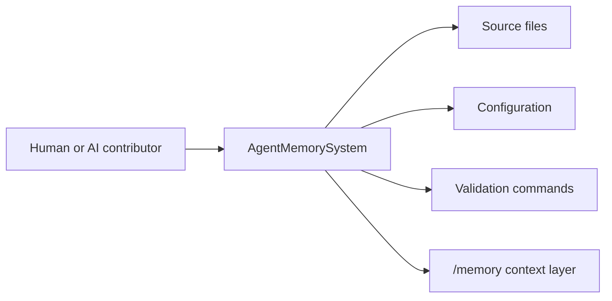

# System Architecture

**Last Updated:** 2026-05-07

---

## Architecture Summary

This is an inferred architecture document. Treat sections marked `[INFERRED]`, `[PLANNED]`, or `[INCOMPLETE]` as prompts for verification before making architectural changes.

## Runtime Shape

- Project profile: `mixed`
- Detected profiles: `backend`, `docs-heavy`, `frontend`, `mixed`, `monorepo`
- Frameworks: Express, FastAPI, Next.js, React, Vitest, pytest

## Mermaid Sketch

## Deployment Hints

- `src/analyzers/manifest.ts`
- `src/maintenance/git.ts`
- `src/scanner/scan.ts`
- `src/templates/format.ts`

## Open Architecture Questions

- [INCOMPLETE] Confirm service boundaries and runtime communication paths with maintainers.
- [INCOMPLETE] Add diagrams for deployed infrastructure once verified.
